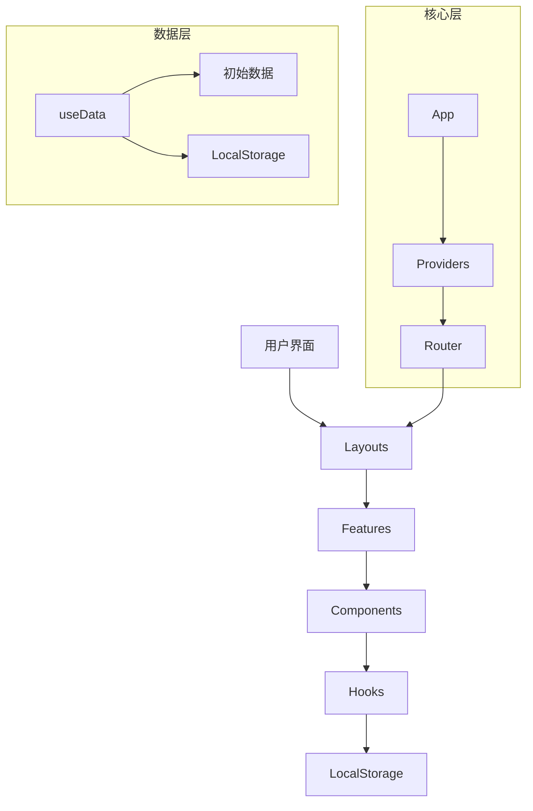

## 1. 仓库概览

AI Resource Hub 是一个基于 React + TypeScript 的前端应用，用于管理和展示 AI 相关的资源，包括学习记录、项目案例、提示词库、行业资讯、AI 资源和 AI 工具。

- **主要功能**：
  - 资源管理：学习记录、项目案例、提示词库、行业资讯、AI 资源、AI 工具的增删改查
  - 主题切换：支持深色/浅色模式
  - 搜索功能：跨资源类型的搜索
  - 响应式设计：适配不同屏幕尺寸
  - 本地存储：数据持久化到 localStorage
  - 统一导航：前台首页和管理后台栏目顺序与名称保持一致

- **典型应用场景**：
  - AI 爱好者和开发者查找相关资源
  - 团队内部资源管理与共享
  - 个人学习资料整理
  - AI 学习记录和笔记管理

## 2. 目录结构

项目采用模块化的目录结构，遵循功能分离的原则。核心代码位于 `src` 目录，按功能模块组织，便于维护和扩展。

```text
├── src/
│   ├── app/                # 应用核心配置
│   │   ├── providers.tsx   # 全局上下文提供者
│   │   └── router.tsx      # 路由配置
│   ├── components/         # 通用组件
│   ├── data/               # 初始数据
│   ├── features/           # 功能模块
│   │   ├── admin/          # 管理后台
│   │   ├── home/           # 首页
│   │   ├── learning-journal/ # 学习记录模块
│   │   ├── news/           # 行业资讯模块
│   │   ├── projects/       # 项目案例模块
│   │   ├── prompts/        # 提示词库模块
│   │   ├── resources/      # AI 资源模块
│   │   ├── search/         # 搜索模块
│   │   └── tools/          # AI 工具模块
│   ├── layouts/            # 布局组件
│   ├── shared/             # 共享资源
│   │   ├── constants/      # 常量定义
│   │   ├── hooks/          # 自定义钩子
│   │   ├── store/          # 状态管理
│   │   ├── types/          # 类型定义
│   │   └── utils/          # 工具函数
│   ├── App.tsx             # 应用根组件
│   ├── index.css           # 全局样式
│   └── main.tsx            # 应用入口
├── public/                 # 静态资源
├── package.json            # 项目配置
├── tailwind.config.js      # Tailwind 配置
└── vite.config.ts          # Vite 配置
```

**模块职责表**：

| 模块 | 主要职责 | 文件位置 | 引用 |
|------|---------|---------|------|
| 核心配置 | 应用路由和全局上下文 | src/app/ | <mcfile name="providers.tsx" path="src/app/providers.tsx"></mcfile>, <mcfile name="router.tsx" path="src/app/router.tsx"></mcfile> |
| 布局组件 | 应用整体布局（前台和管理后台） | src/layouts/ | <mcfile name="MainLayout.tsx" path="src/layouts/MainLayout.tsx"></mcfile>, <mcfile name="AdminLayout.tsx" path="src/layouts/AdminLayout.tsx"></mcfile> |
| 数据管理 | 全局数据状态和持久化 | src/shared/hooks/useData.tsx | <mcfile name="useData.tsx" path="src/shared/hooks/useData.tsx"></mcfile> |
| 主题管理 | 深色/浅色模式切换 | src/shared/hooks/useTheme.tsx | <mcfile name="useTheme.tsx" path="src/shared/hooks/useTheme.tsx"></mcfile> |
| 功能模块 | 各业务功能实现（6 大栏目） | src/features/ | 学习记录、项目案例、提示词库、行业资讯、AI 资源、AI 工具 |

## 3. 系统架构与主流程

AI Resource Hub 采用现代 React 前端架构，基于组件化和上下文管理构建。

### 架构图



### 主要流程

1. **应用初始化**：
   - `main.tsx` 作为入口点，渲染 `App` 组件
   - `App` 组件加载 `Providers` 和 `AppRouter`
   - `Providers` 初始化全局上下文（主题、数据）
   - `AppRouter` 配置路由结构

2. **数据管理流程**：
   - `useData` 钩子从 localStorage 加载数据，若不存在则使用初始数据
   - 数据变更时自动持久化到 localStorage
   - 提供增删改查方法操作数据

3. **用户交互流程**：
   - 用户通过导航栏访问不同页面（学习记录、项目案例、提示词库、行业资讯、AI 资源、AI 工具）
   - 可通过搜索功能查找资源
   - 管理员可通过后台管理资源（6 大栏目统一管理）
   - 支持主题切换功能
   - 前台和管理后台栏目顺序与名称保持一致

## 4. 核心功能模块

### 4.1 数据管理模块

**功能描述**：管理应用所有数据，包括新闻、工具、提示词和项目，支持增删改查操作，并将数据持久化到 localStorage。

**实现原理**：
- 使用 React Context API 创建全局数据上下文
- 利用 `useState` 管理数据状态
- 通过 `useEffect` 监听数据变化并持久化
- 提供 `useData` 钩子供组件使用

**关键代码**：
<mcfile name="useData.tsx" path="src/shared/hooks/useData.tsx"></mcfile> 中的 `DataProvider` 组件和 `useData` 钩子。

### 4.2 主题管理模块

**功能描述**：实现深色/浅色模式切换，并持久化用户偏好。

**实现原理**：
- 使用 React Context API 创建主题上下文
- 从 localStorage 加载主题偏好，或使用系统默认设置
- 提供 `useTheme` 钩子供组件使用
- 通过修改根元素类名实现主题切换

**关键代码**：
<mcfile name="useTheme.tsx" path="src/shared/hooks/useTheme.tsx"></mcfile> 中的 `ThemeProvider` 组件和 `useTheme` 钩子。

### 4.3 搜索功能模块

**功能描述**：支持跨资源类型的搜索，包括新闻、工具、提示词和项目。

**实现原理**：
- 实现搜索算法，支持模糊匹配
- 提供搜索模态框组件
- 实时显示搜索结果

**关键代码**：
<mcfile name="search.ts" path="src/shared/utils/search.ts"></mcfile> 中的搜索函数。

### 4.4 管理后台模块

**功能描述**：提供资源的管理界面，支持添加、编辑和删除操作。

**实现原理**：
- 独立的管理布局
- 表单组件用于数据输入
- 调用 `useData` 钩子的方法操作数据

**关键代码**：
<mcfile name="AdminDashboard.tsx" path="src/features/admin/pages/AdminDashboard.tsx"></mcfile> 和各资源管理页面。

## 5. 核心 API/类/函数

### 5.1 useData 钩子

**功能**：提供全局数据访问和操作方法。

**参数**：无

**返回值**：
- `news`: 新闻列表
- `tools`: 工具列表
- `prompts`: 提示词列表
- `projects`: 项目列表
- 各类资源的增删改查方法
- `resetToDefaults`: 重置数据到默认值

**使用场景**：需要访问或修改应用数据的组件。

**关键代码**：
<mcfile name="useData.tsx" path="src/shared/hooks/useData.tsx"></mcfile> 中的 `useData` 函数。

### 5.2 useTheme 钩子

**功能**：提供主题管理功能。

**参数**：无

**返回值**：
- `theme`: 当前主题（'dark' 或 'light'）
- `toggleTheme`: 切换主题的方法
- `setTheme`: 设置主题的方法

**使用场景**：需要访问或修改主题的组件。

**关键代码**：
<mcfile name="useTheme.tsx" path="src/shared/hooks/useTheme.tsx"></mcfile> 中的 `useTheme` 函数。

### 5.3 DataProvider 组件

**功能**：提供全局数据上下文。

**参数**：
- `children`: React 子组件

**使用场景**：应用根组件，包裹整个应用。

**关键代码**：
<mcfile name="useData.tsx" path="src/shared/hooks/useData.tsx"></mcfile> 中的 `DataProvider` 组件。

### 5.4 ThemeProvider 组件

**功能**：提供全局主题上下文。

**参数**：
- `children`: React 子组件

**使用场景**：应用根组件，包裹整个应用。

**关键代码**：
<mcfile name="useTheme.tsx" path="src/shared/hooks/useTheme.tsx"></mcfile> 中的 `ThemeProvider` 组件。

### 5.5 AppRouter 组件

**功能**：配置应用路由。

**参数**：无

**返回值**：React 组件

**使用场景**：应用根组件，提供路由功能。

**关键代码**：
<mcfile name="router.tsx" path="src/app/router.tsx"></mcfile> 中的 `AppRouter` 函数。

## 6. 技术栈与依赖

| 技术/依赖 | 版本 | 用途 | 来源 |
|-----------|------|------|------|
| React | ^18.3.1 | 前端框架 | <mcfile name="package.json" path="package.json"></mcfile> |
| React Router DOM | ^6.26.0 | 路由管理 | <mcfile name="package.json" path="package.json"></mcfile> |
| TypeScript | ^5.5.3 | 类型系统 | <mcfile name="package.json" path="package.json"></mcfile> |
| Tailwind CSS | ^3.4.10 | 样式框架 | <mcfile name="package.json" path="package.json"></mcfile> |
| Lucide React | ^0.441.0 | 图标库 | <mcfile name="package.json" path="package.json"></mcfile> |
| React Markdown | ^9.0.1 | Markdown 渲染 | <mcfile name="package.json" path="package.json"></mcfile> |
| Vite | ^5.4.1 | 构建工具 | <mcfile name="package.json" path="package.json"></mcfile> |

**技术选型分析**：
- **React 18**：利用其新特性如 Suspense 和 Concurrent Mode，提升应用性能和用户体验
- **TypeScript**：提供类型安全，减少运行时错误
- **Tailwind CSS**：采用实用优先的 CSS 框架，加快开发速度
- **React Router**：实现单页应用路由管理
- **LocalStorage**：实现数据持久化，无需后端服务

## 7. 关键模块与典型用例

### 7.1 数据管理模块使用

**功能说明**：管理应用中的各种资源数据。

**配置与依赖**：
- 依赖 `localStorage` 进行数据持久化
- 初始数据定义在 `src/data/` 目录

**使用示例**：

```typescript
import { useData } from '@/shared/hooks'

function MyComponent() {
  const { news, addNews, deleteNews } = useData()

  const handleAddNews = () => {
    addNews({
      title: 'New AI Breakthrough',
      summary: 'Latest developments in AI research',
      content: 'Detailed content...',
      category: 'Research',
      tags: ['AI', 'Research', 'Breakthrough']
    })
  }

  return (
    <div>
      <button onClick={handleAddNews}>Add News</button>
      <ul>
        {news.map(item => (
          <li key={item.id}>
            {item.title}
            <button onClick={() => deleteNews(item.id)}>Delete</button>
          </li>
        ))}
      </ul>
    </div>
  )
}
```

### 7.2 主题切换功能

**功能说明**：切换应用的深色/浅色模式。

**配置与依赖**：
- 依赖 `localStorage` 保存主题偏好
- 系统默认主题通过 `window.matchMedia` 获取

**使用示例**：

```typescript
import { useTheme } from '@/shared/hooks'

function ThemeToggle() {
  const { theme, toggleTheme } = useTheme()

  return (
    <button onClick={toggleTheme}>
      Switch to {theme === 'dark' ? 'light' : 'dark'} mode
    </button>
  )
}
```

### 7.3 搜索功能

**功能说明**：搜索应用中的资源。

**配置与依赖**：
- 搜索算法实现于 `src/shared/utils/search.ts`

**使用示例**：
通过点击导航栏的搜索按钮打开搜索模态框，输入关键词进行搜索。

## 8. 配置、部署与开发

### 8.1 开发环境配置

**前置条件**：
- Node.js 16+
- npm 或 yarn

**开发流程**：
1. 克隆仓库
2. 安装依赖：`npm install`
3. 启动开发服务器：`npm run dev`
4. 访问：`http://localhost:5173`

**构建与部署**：
1. 构建生产版本：`npm run build`
2. 构建产物位于 `dist` 目录
3. 可部署到任何静态网站托管服务

### 8.2 项目配置文件

| 配置文件 | 用途 | 位置 |
|---------|------|------|
| package.json | 项目依赖和脚本 | <mcfile name="package.json" path="package.json"></mcfile> |
| tsconfig.json | TypeScript 配置 | <mcfile name="tsconfig.json" path="tsconfig.json"></mcfile> |
| tailwind.config.js | Tailwind CSS 配置 | <mcfile name="tailwind.config.js" path="tailwind.config.js"></mcfile> |
| vite.config.ts | Vite 构建配置 | <mcfile name="vite.config.ts" path="vite.config.ts"></mcfile> |

## 9. 监控与维护

### 9.1 错误处理

项目在数据持久化过程中包含错误处理，当 localStorage 操作失败时会在控制台输出错误信息：

```typescript
function loadFromStorage<T>(key: string, defaultValue: T[]): T[] {
  try {
    const stored = localStorage.getItem(key)
    if (stored) {
      return JSON.parse(stored)
    }
  } catch (e) {
    console.error(`Error loading ${key} from localStorage:`, e)
  }
  return defaultValue
}
```

### 9.2 性能优化

- **代码分割**：使用 React.lazy 和 Suspense 实现路由级别的代码分割
- **状态管理**：使用 Context API 进行轻量级状态管理，避免引入复杂状态管理库
- **本地存储**：数据持久化到 localStorage，减少重复加载

## 10. 总结与亮点回顾

AI Resource Hub 是一个设计良好的前端应用，具有以下亮点：

1. **模块化架构**：清晰的目录结构和功能分离，便于维护和扩展
2. **类型安全**：全面使用 TypeScript，提供类型保障
3. **响应式设计**：适配不同屏幕尺寸，提供良好的用户体验
4. **数据持久化**：使用 localStorage 实现数据持久化，无需后端服务
5. **主题切换**：支持深色/浅色模式，提升用户体验
6. **搜索功能**：实现跨资源类型的搜索，方便用户查找信息
7. **管理后台**：提供完整的资源管理功能
8. **性能优化**：使用代码分割和轻量级状态管理，提升应用性能

**技术亮点**：
- 利用 React 18 的 Suspense 特性实现异步组件加载
- 自定义 Hooks 封装业务逻辑，提高代码复用性
- 模块化设计，每个功能模块独立封装
- 响应式 UI 设计，适配不同设备

**应用价值**：
- 为 AI 爱好者和开发者提供了一个集中管理和查找 AI 相关资源的平台
- 无需后端服务即可运行，部署简单
- 可作为个人或团队的资源管理工具
- 代码结构清晰，可作为学习 React + TypeScript 项目的参考

AI Resource Hub 展示了如何构建一个功能完整、用户友好的现代前端应用，通过合理的架构设计和技术选型，实现了良好的用户体验和代码可维护性。