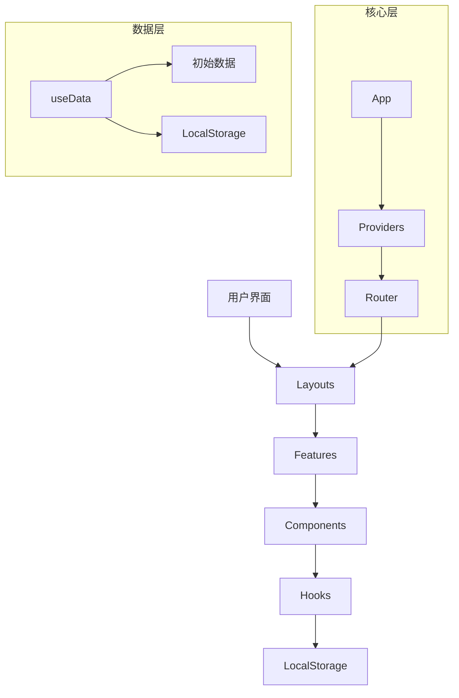

## 1. 仓库概览

AI Resource Hub（AI 资源中心）是一个基于 React + TypeScript 的现代化前端应用，用于管理和展示 AI 相关的资源。平台采用 GitHub 仓库存储数据，无需后端服务器，零成本实现数据的集中管理和自动更新。

- **核心特色**：
  - ✅ **GitHub 数据同步**：从 GitHub 仓库自动同步数据，支持首次启动自动同步和手动同步
  - ✅ **智能数据管理**：用户数据优先策略，本地缓存与云端数据智能合并
  - ✅ **六大栏目**：学习记录、项目案例、提示词库、行业资讯、AI 资源、AI 工具
  - ✅ **主题切换**：支持深色/浅色模式，自动适配系统偏好
  - ✅ **全局搜索**：跨所有栏目的智能搜索，支持模糊匹配和关键词高亮
  - ✅ **响应式设计**：完美适配桌面端和移动端
  - ✅ **统一导航**：前台首页和管理后台栏目顺序与名称保持一致

- **典型应用场景**：
  - AI 爱好者和开发者查找相关资源和工具
  - 团队内部知识管理与资源共享
  - 个人学习资料整理和笔记管理
  - AI 项目案例展示和技术实践分享
  - 行业资讯聚合和追踪

## 2. 目录结构

项目采用模块化的目录结构，遵循功能分离的原则。核心代码位于 `src` 目录，按功能模块组织，便于维护和扩展。

```text
├── src/
│   ├── app/                # 应用核心配置
│   │   ├── providers.tsx   # 全局上下文提供者
│   │   └── router.tsx      # 路由配置
│   ├── components/         # 通用组件
│   ├── data/               # 初始数据
│   ├── features/           # 功能模块
│   │   ├── admin/          # 管理后台
│   │   ├── home/           # 首页
│   │   ├── learning-journal/ # 学习记录模块
│   │   ├── news/           # 行业资讯模块
│   │   ├── projects/       # 项目案例模块
│   │   ├── prompts/        # 提示词库模块
│   │   ├── resources/      # AI 资源模块
│   │   ├── search/         # 搜索模块
│   │   └── tools/          # AI 工具模块
│   ├── layouts/            # 布局组件
│   ├── shared/             # 共享资源
│   │   ├── constants/      # 常量定义
│   │   ├── hooks/          # 自定义钩子
│   │   ├── store/          # 状态管理
│   │   ├── types/          # 类型定义
│   │   └── utils/          # 工具函数
│   ├── App.tsx             # 应用根组件
│   ├── index.css           # 全局样式
│   └── main.tsx            # 应用入口
├── public/                 # 静态资源
├── package.json            # 项目配置
├── tailwind.config.js      # Tailwind 配置
└── vite.config.ts          # Vite 配置
```

**模块职责表**：

| 模块 | 主要职责 | 文件位置 | 引用 |
|------|---------|---------|------|
| 核心配置 | 应用路由和全局上下文 | src/app/ | <mcfile name="providers.tsx" path="src/app/providers.tsx"></mcfile>, <mcfile name="router.tsx" path="src/app/router.tsx"></mcfile> |
| 布局组件 | 应用整体布局（前台和管理后台） | src/layouts/ | <mcfile name="MainLayout.tsx" path="src/layouts/MainLayout.tsx"></mcfile>, <mcfile name="AdminLayout.tsx" path="src/layouts/AdminLayout.tsx"></mcfile> |
| 数据管理 | 全局数据状态、持久化和 GitHub 同步 | src/shared/hooks/useData.tsx | <mcfile name="useData.tsx" path="src/shared/hooks/useData.tsx"></mcfile> |
| 主题管理 | 深色/浅色模式切换 | src/shared/hooks/useTheme.tsx | <mcfile name="useTheme.tsx" path="src/shared/hooks/useTheme.tsx"></mcfile> |
| GitHub 同步 | GitHub API 集成、数据同步和 Markdown 解析 | src/shared/services/, src/shared/utils/ | <mcfile name="dataSync.ts" path="src/shared/services/dataSync.ts"></mcfile>, <mcfile name="githubApi.ts" path="src/shared/utils/githubApi.ts"></mcfile>, <mcfile name="markdownParser.ts" path="src/shared/utils/markdownParser.ts"></mcfile> |
| 功能模块 | 各业务功能实现（6 大栏目） | src/features/ | 学习记录、项目案例、提示词库、行业资讯、AI 资源、AI 工具 |

## 3. 系统架构与主流程

AI Resource Hub 采用现代 React 前端架构，基于组件化和上下文管理构建。

### 架构图



### 主要流程

1. **应用初始化**：
   - `main.tsx` 作为入口点，渲染 `App` 组件
   - `App` 组件加载 `Providers` 和 `AppRouter`
   - `Providers` 初始化全局上下文（主题、数据）
   - `AppRouter` 配置路由结构

2. **数据管理流程**：
   - **首次启动**：自动从 GitHub 仓库同步数据到 localStorage
   - **日常使用**：从 localStorage 加载数据，提供极速访问体验
   - **数据变更**：自动持久化到 localStorage
   - **手动同步**：可随时从 GitHub 仓库拉取最新数据
   - **智能合并**：用户数据优先，自动补充 GitHub 新数据

3. **用户交互流程**：
   - 用户通过导航栏访问不同页面（学习记录、项目案例、提示词库、行业资讯、AI 资源、AI 工具）
   - 可通过全局搜索功能查找资源
   - 管理员可通过后台管理资源（6 大栏目统一管理）
   - 支持主题切换功能（深色/浅色模式）
   - 前台和管理后台栏目顺序与名称保持一致

## 4. 核心功能模块

### 4.1 数据管理模块

**功能描述**：管理应用所有数据，包括学习记录、项目案例、提示词库、行业资讯、AI 资源和 AI 工具，支持增删改查操作，并将数据持久化到 localStorage。集成 GitHub 数据同步功能，实现云端数据和本地数据的智能合并。

**实现原理**：
- 使用 React Context API 创建全局数据上下文
- 利用 `useState` 管理数据状态
- 通过 `useEffect` 监听数据变化并持久化
- 提供 `useData` 钩子供组件使用
- 支持 6 大栏目数据的统一管理
- **GitHub 同步**：首次启动自动同步，手动同步，用户数据优先策略

**关键代码**：
<mcfile name="useData.tsx" path="src/shared/hooks/useData.tsx"></mcfile> 中的 `DataProvider` 组件和 `useData` 钩子。

### 4.2 GitHub 数据同步模块

**功能描述**：实现从 GitHub 仓库自动同步数据的功能，无需后端服务器，零成本实现数据的集中管理和自动更新。

**实现原理**：
- **GitHub API 集成**：使用 GitHub REST API v3 获取仓库文件内容
- **Markdown 解析**：解析带有 Front Matter 和嵌入 JSON 的 Markdown 文件
- **版本控制**：通过 version.json 管理数据版本，支持增量更新
- **智能合并**：用户数据优先，自动补充 GitHub 新数据
- **本地缓存**：同步后的数据存储到 localStorage，支持离线使用

**同步流程**：
1. 检查版本 - 对比本地版本和 GitHub 版本
2. 下载数据 - 从 GitHub 获取最新数据（6 个类别）
3. 解析数据 - 解析 Markdown 中的 JSON 数据
4. 智能合并 - 用户数据优先，补充新数据
5. 保存缓存 - 更新 localStorage
6. 更新状态 - 记录同步时间和版本

**关键代码**：
- <mcfile name="dataSync.ts" path="src/shared/services/dataSync.ts"></mcfile> - 数据同步服务
- <mcfile name="githubApi.ts" path="src/shared/utils/githubApi.ts"></mcfile> - GitHub API 客户端
- <mcfile name="markdownParser.ts" path="src/shared/utils/markdownParser.ts"></mcfile> - Markdown 解析工具
- <mcfile name="dataMerger.ts" path="src/shared/utils/dataMerger.ts"></mcfile> - 数据合并工具

**相关文档**：
- [数据同步使用指南](docs/DATA_SYNC_GUIDE.md)
- [GitHub 同步实施总结](docs/GITHUB_SYNC_IMPLEMENTATION.md)
- [中文乱码修复文档](docs/GITHUB_SYNC_FIX.md)

### 4.3 主题管理模块

**功能描述**：实现深色/浅色模式切换，并持久化用户偏好。

**实现原理**：
- 使用 React Context API 创建主题上下文
- 从 localStorage 加载主题偏好，或使用系统默认设置
- 提供 `useTheme` 钩子供组件使用
- 通过修改根元素类名实现主题切换

**关键代码**：
<mcfile name="useTheme.tsx" path="src/shared/hooks/useTheme.tsx"></mcfile> 中的 `ThemeProvider` 组件和 `useTheme` 钩子。

### 4.4 搜索功能模块

**功能描述**：支持跨所有栏目（学习记录、项目案例、提示词库、行业资讯、AI 资源、AI 工具）的全局搜索，包括新闻、工具、提示词、项目、资源和学习记录。

**实现原理**：
- 实现智能搜索算法，支持模糊匹配和关键词高亮
- 提供搜索模态框组件和搜索结果页面
- 实时显示搜索结果，按类别分组展示

**关键代码**：
<mcfile name="search.ts" path="src/shared/utils/search.ts"></mcfile> 中的搜索函数。

### 4.5 管理后台模块

**功能描述**：提供资源的管理界面，支持学习记录、项目案例、提示词库、行业资讯、AI 资源、AI 工具的添加、编辑和删除操作。管理后台与前台首页栏目顺序和名称保持一致。

**实现原理**：
- 独立的管理布局（AdminLayout）
- 表单组件用于数据输入
- 调用 `useData` 钩子的方法操作数据
- 仪表盘显示各栏目统计数据和快速操作入口
- 统一的导航菜单和栏目管理

**关键代码**：
<mcfile name="AdminDashboard.tsx" path="src/features/admin/pages/AdminDashboard.tsx"></mcfile>、<mcfile name="AdminLayout.tsx" path="src/layouts/AdminLayout.tsx"></mcfile> 和各资源管理页面。

## 5. 核心 API/类/函数

### 5.1 useData 钩子

**功能**：提供全局数据访问和操作方法。

**参数**：无

**返回值**：
- `learningJournals`: 学习记录列表
- `projects`: 项目案例列表
- `prompts`: 提示词库列表
- `news`: 行业资讯列表
- `resources`: AI 资源列表
- `tools`: AI 工具列表
- 各类资源的增删改查方法
- `resetToDefaults`: 重置数据到默认值

**使用场景**：需要访问或修改应用数据的组件。

**关键代码**：
<mcfile name="useData.tsx" path="src/shared/hooks/useData.tsx"></mcfile> 中的 `useData` 函数。

### 5.2 useTheme 钩子

**功能**：提供主题管理功能。

**参数**：无

**返回值**：
- `theme`: 当前主题（'dark' 或 'light'）
- `toggleTheme`: 切换主题的方法
- `setTheme`: 设置主题的方法

**使用场景**：需要访问或修改主题的组件。

**关键代码**：
<mcfile name="useTheme.tsx" path="src/shared/hooks/useTheme.tsx"></mcfile> 中的 `useTheme` 函数。

### 5.3 DataProvider 组件

**功能**：提供全局数据上下文。

**参数**：
- `children`: React 子组件

**使用场景**：应用根组件，包裹整个应用。

**关键代码**：
<mcfile name="useData.tsx" path="src/shared/hooks/useData.tsx"></mcfile> 中的 `DataProvider` 组件。

### 5.4 ThemeProvider 组件

**功能**：提供全局主题上下文。

**参数**：
- `children`: React 子组件

**使用场景**：应用根组件，包裹整个应用。

**关键代码**：
<mcfile name="useTheme.tsx" path="src/shared/hooks/useTheme.tsx"></mcfile> 中的 `ThemeProvider` 组件。

### 5.5 AppRouter 组件

**功能**：配置应用路由。

**参数**：无

**返回值**：React 组件

**使用场景**：应用根组件，提供路由功能。

**关键代码**：
<mcfile name="router.tsx" path="src/app/router.tsx"></mcfile> 中的 `AppRouter` 函数。

## 6. 技术栈与依赖

| 技术/依赖 | 版本 | 用途 | 来源 |
|-----------|------|------|------|
| React | ^18.3.1 | 前端框架 | <mcfile name="package.json" path="package.json"></mcfile> |
| React Router DOM | ^6.26.0 | 路由管理 | <mcfile name="package.json" path="package.json"></mcfile> |
| TypeScript | ^5.5.3 | 类型系统 | <mcfile name="package.json" path="package.json"></mcfile> |
| Tailwind CSS | ^3.4.10 | 样式框架 | <mcfile name="package.json" path="package.json"></mcfile> |
| Lucide React | ^0.441.0 | 图标库 | <mcfile name="package.json" path="package.json"></mcfile> |
| React Markdown | ^9.0.1 | Markdown 渲染 | <mcfile name="package.json" path="package.json"></mcfile> |
| Vite | ^5.4.1 | 构建工具 | <mcfile name="package.json" path="package.json"></mcfile> |
| Vitest | ^4.1.4 | 测试框架 | <mcfile name="package.json" path="package.json"></mcfile> |
| Testing Library | ^16.3.2 | React 测试工具 | <mcfile name="package.json" path="package.json"></mcfile> |

**技术选型分析**：
- **React 18**：利用其新特性如 Suspense 和 Concurrent Mode，提升应用性能和用户体验
- **TypeScript**：提供类型安全，减少运行时错误，完善的类型定义覆盖所有数据模型
- **Tailwind CSS**：采用实用优先的 CSS 框架，加快开发速度，支持自定义主题和深色模式
- **React Router**：实现单页应用路由管理，支持懒加载和代码分割
- **LocalStorage**：实现数据持久化，无需后端服务，支持离线使用
- **GitHub API**：利用 GitHub 仓库作为数据源，零成本实现云端数据存储和同步
- **Vitest**：现代化的测试框架，提供快速的测试执行和覆盖率报告

## 7. 关键模块与典型用例

### 7.1 数据管理模块使用

**功能说明**：管理应用中的各种资源数据。

**配置与依赖**：
- 依赖 `localStorage` 进行数据持久化
- 初始数据定义在 `src/data/` 目录

**使用示例**：

```typescript
import { useData } from '@/shared/hooks'

function MyComponent() {
  const { learningJournals, projects, prompts, news, resources, tools } = useData()

  const handleAddLearningJournal = () => {
    addLearningJournal({
      title: '深度学习入门学习笔记',
      excerpt: '记录深度学习的基础知识',
      content: '详细内容...',
      category: '深度学习',
      tags: ['深度学习', '神经网络', '基础']
    })
  }

  return (
    <div>
      <button onClick={handleAddLearningJournal}>添加学习记录</button>
      <ul>
        {learningJournals.map(item => (
          <li key={item.id}>
            {item.title}
            <button onClick={() => deleteLearningJournal(item.id)}>删除</button>
          </li>
        ))}
      </ul>
    </div>
  )
}
```

### 7.2 主题切换功能

**功能说明**：切换应用的深色/浅色模式。

**配置与依赖**：
- 依赖 `localStorage` 保存主题偏好
- 系统默认主题通过 `window.matchMedia` 获取

**使用示例**：

```typescript
import { useTheme } from '@/shared/hooks'

function ThemeToggle() {
  const { theme, toggleTheme } = useTheme()

  return (
    <button onClick={toggleTheme}>
      Switch to {theme === 'dark' ? 'light' : 'dark'} mode
    </button>
  )
}
```

### 7.3 搜索功能

**功能说明**：搜索应用中的资源，支持跨 6 大栏目（学习记录、项目案例、提示词库、行业资讯、AI 资源、AI 工具）的搜索。

**配置与依赖**：
- 搜索算法实现于 `src/shared/utils/search.ts`

**使用示例**：
通过点击导航栏的搜索按钮打开搜索模态框，输入关键词进行搜索，支持模糊匹配。

## 8. 配置、部署与开发

### 8.1 开发环境配置

**前置条件**：
- Node.js 16+
- npm 或 yarn

**开发流程**：
1. 克隆仓库
2. 安装依赖：`npm install`
3. 启动开发服务器：`npm run dev`
4. 访问：`http://localhost:5173`

**构建与部署**：
1. 构建生产版本：`npm run build`
2. 构建产物位于 `dist` 目录
3. 可部署到任何静态网站托管服务

### 8.2 项目配置文件

| 配置文件 | 用途 | 位置 |
|---------|------|------|
| package.json | 项目依赖和脚本 | <mcfile name="package.json" path="package.json"></mcfile> |
| tsconfig.json | TypeScript 配置 | <mcfile name="tsconfig.json" path="tsconfig.json"></mcfile> |
| tailwind.config.js | Tailwind CSS 配置 | <mcfile name="tailwind.config.js" path="tailwind.config.js"></mcfile> |
| vite.config.ts | Vite 构建配置 | <mcfile name="vite.config.ts" path="vite.config.ts"></mcfile> |

## 9. 监控与维护

### 9.1 错误处理

项目在数据持久化和 GitHub 同步过程中包含完善的错误处理：

**LocalStorage 错误处理**:
```typescript
function loadFromStorage<T>(key: string, defaultValue: T[]): T[] {
  try {
    const stored = localStorage.getItem(key)
    if (stored) {
      return JSON.parse(stored)
    }
  } catch (e) {
    console.error(`Error loading ${key} from localStorage:`, e)
  }
  return defaultValue
}
```

**GitHub 同步错误处理**:
- 网络错误处理：检测网络连接状态
- GitHub API 限流处理：未认证用户 60 次/小时
- 数据解析错误处理：Markdown 解析失败提示
- 友好的错误提示：用户友好的错误信息

### 9.2 性能优化

- **代码分割**：使用 React.lazy 和 Suspense 实现路由级别的代码分割
- **状态管理**：使用 Context API 进行轻量级状态管理，避免引入复杂状态管理库
- **本地存储**：数据持久化到 localStorage，减少重复加载
- **懒加载**：所有路由组件采用懒加载，提升首屏性能
- **缓存策略**：GitHub 数据同步后缓存到 localStorage，支持离线使用

### 9.3 GitHub 数据仓库

项目使用 GitHub 仓库作为数据源，实现了零成本的数据同步方案。

**数据仓库**:
- **仓库地址**: https://github.com/snipercai/ai-hub-data
- **数据格式**: Markdown with Front Matter + Embedded JSON
- **版本管理**: version.json 文件管理数据版本
- **访问方式**: GitHub REST API v3（公开仓库，无需 Token）

**数据结构**:
```
ai-hub-data/
├── version.json          # 数据版本信息
├── news/
│   └── index.md         # 行业资讯列表
├── tools/
│   └── index.md         # AI 工具列表
├── prompts/
│   └── index.md         # 提示词库列表
├── projects/
│   └── index.md         # 项目案例列表
├── resources/
│   └── index.md         # AI 资源列表
└── learning-journal/
    └── index.md         # 学习记录列表
```

**同步策略**:
- **首次启动**: 自动从 GitHub 同步所有数据
- **手动同步**: 用户可随时在管理后台触发同步
- **智能合并**: 用户数据优先，自动补充 GitHub 新数据
- **离线支持**: 同步后数据缓存到本地，支持离线使用

**相关文档**:
- [数据同步使用指南](docs/DATA_SYNC_GUIDE.md)
- [GitHub 同步实施总结](docs/GITHUB_SYNC_IMPLEMENTATION.md)
- [中文乱码修复文档](docs/GITHUB_SYNC_FIX.md)

## 10. 总结与亮点回顾

AI Resource Hub（AI 资源中心）是一个设计良好、功能完整的现代化前端应用，具有以下核心亮点：

### 核心亮点

1. **GitHub 数据同步** 🔄
   - 无需后端服务器，零成本实现数据集中管理
   - 首次启动自动同步，手动同步随时更新
   - 用户数据优先策略，智能合并云端和本地数据
   - 支持离线使用，极速加载体验

2. **模块化架构** 🏗️
   - 清晰的目录结构和功能分离，便于维护和扩展
   - 6 大栏目独立模块，统一的数据模型和接口
   - 前后分离的布局系统，前台展示与后台管理

3. **类型安全** 🛡️
   - 全面使用 TypeScript，提供完整的类型定义
   - 6 大数据模型（NewsItem, ToolItem, ResourceItem, PromptItem, ProjectItem, LearningJournalItem）
   - 编译时类型检查，减少运行时错误

4. **智能搜索** 🔍
   - 跨所有栏目的全局搜索
   - 支持模糊匹配和关键词高亮
   - 按类别分组展示搜索结果

5. **主题切换** 🎨
   - 支持深色/浅色模式
   - 自动适配系统偏好
   - 持久化用户设置

6. **响应式设计** 📱
   - 完美适配桌面端和移动端
   - 自适应布局，流畅的动画效果
   - 移动端友好的侧边栏导航

7. **管理后台** 👨‍💼
   - 完整的 6 大栏目管理功能
   - 仪表盘数据概览和快速操作
   - 数据同步状态监控

8. **统一导航** 🧭
   - 前台首页和管理后台栏目顺序与名称保持一致
   - 直观的图标和文字标签
   - 面包屑导航和返回按钮

9. **性能优化** ⚡
   - 代码分割和懒加载
   - 本地缓存和离线支持
   - 轻量级状态管理（Context API）

10. **测试体系** 🧪
    - 基于 Vitest 的完整测试框架
    - 组件测试、Hooks 测试、类型测试
    - 测试覆盖率报告

### 技术亮点

- **React 18 Suspense**：异步组件加载，提升首屏性能
- **自定义 Hooks**：封装业务逻辑，提高代码复用性（useData, useTheme, useSearch, useDocumentTitle）
- **模块化设计**：每个功能模块独立封装，高内聚低耦合
- **响应式 UI**：基于 Tailwind CSS 的实用优先设计
- **智能数据合并**：用户数据优先，自动补充新数据
- **GitHub API 集成**：RESTful API 调用，Base64 编解码，UTF-8 正确处理

### 应用价值

- ✅ 为 AI 爱好者和开发者提供了一个集中管理和查找 AI 相关资源的平台
- ✅ 支持 AI 学习记录管理，方便个人学习和知识积累
- ✅ 无需后端服务即可运行，部署简单，零成本维护
- ✅ 可作为个人或团队的资源管理工具
- ✅ 代码结构清晰，可作为学习 React + TypeScript 项目的参考

### 栏目结构

| 序号 | 栏目名称 | 说明 | 路由 |
|------|---------|------|------|
| 1 | 学习记录 | AI 学习心得、实验记录、技术探索笔记 | `/learning-journal` |
| 2 | 项目案例 | 开源项目展示和技术实践案例 | `/projects` |
| 3 | 提示词库 | 实用的 AI 提示词和最佳实践 | `/prompts` |
| 4 | 行业资讯 | AI 领域最新动态和技术新闻 | `/news` |
| 5 | AI 资源 | AI 学习资源、平台和服务 | `/resources` |
| 6 | AI 工具 | 实用的 AI 工具和应用程序 | `/tools` |

### 管理后台功能

| 功能 | 说明 | 路由 |
|------|------|------|
| 仪表盘 | 数据概览、快速操作、系统状态 | `/admin` |
| 学习记录管理 | 增删改查学习记录 | `/admin/learning-journal` |
| 项目案例管理 | 增删改查项目案例 | `/admin/projects` |
| 提示词库管理 | 增删改查提示词 | `/admin/prompts` |
| 行业资讯管理 | 增删改查行业资讯 | `/admin/news` |
| AI 资源管理 | 增删改查 AI 资源 | `/admin/resources` |
| AI 工具管理 | 增删改查 AI 工具 | `/admin/tools` |
| 数据同步 | GitHub 数据同步设置和状态 | `/admin/sync` |

AI Resource Hub 展示了如何构建一个功能完整、用户友好的现代前端应用，通过合理的架构设计和技术选型，实现了良好的用户体验和代码可维护性。项目采用 GitHub 仓库作为数据源，创新性地实现了零成本的数据同步方案，为类似应用提供了优秀的参考范例。